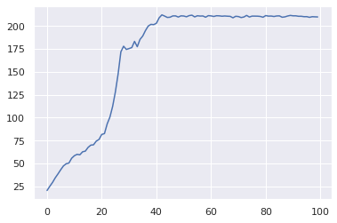
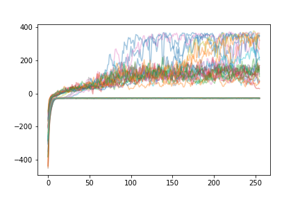
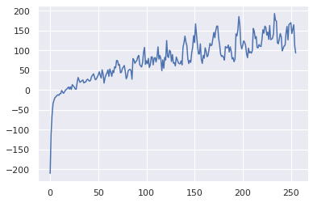

## REINFORCE Review

In the [previous post]() we introduce REINFORCE, an **on-policy policy gradient algorithm**. The policy gradient theorem gives the gradient of the sum of returns for a rollout with respect to the policy parameters $\theta$:

$$
\nabla_\theta J(\theta) = \mathbb{E}_\tau \left[ \sum_{t=0}^T \nabla_\theta \log \pi_\theta (a_t \mid s_t) Q^{\pi_\theta}(s_t, a_t) \right]
$$

REINFORCE samples this gradient estimate by performing a series of $N$ **rollouts** in the environment to collect trajectories $\tau$, and then computing the **empirical returns** $G_t$ as a substitute for $Q^{\pi_\theta}(s_t, a_t)$.
For each rollout we then compute the gradient $\nabla_\theta \log \pi_\theta(a_t \mid s_t)$ for each time step, and sum over timesteps to get an estimate for the policy gradient. We then average over rollouts to get a less noisy estimate for the gradient than a single rollout alone.

$$
\hat{g} = \frac{1}{N} \sum_{n=1}^N \sum_{t=0}^T \nabla_\theta \log \pi_\theta (a_t \mid s_t) G_t
$$

We update the policy parameters by stochastic gradient ascent (or some other gradient-based optimizer):

$$
\theta \gets \theta + \alpha \hat{g}
$$

## Baselines

One issue with using the empirical returns $G_t$ directly is that the scale of the returns can be quite large depending on the scale of the rewards, the value of $\gamma$, and the time horizon $T$ of the environment. For example, in the `CartPole-v0` problem, the time horizon is $T=200$ and the rewards are $r_t = 1$. The maximum return is then

$$
G_0 = \sum_{t=0}^{199} 1 \gamma^t = \frac{1-\gamma^200}{1-\gamma}
$$

which for $\gamma = 0.99$ is about $181$. Returns with large scale like this can be highly variable, and as a consequence our estimates for the gradient can be highly variable.

It turns out that we can modify the policy gradient theorem to reduce the variance!

$$
\nabla_\theta J(\theta) = \mathbb{E}_\tau \left[ \sum_{t=0}^T \log \pi_\theta(s_t \mid a_t) (Q^{\pi_\theta}(s_t, a_t) - b(s_t)) \right]
$$

we can subtract a **baseline** $b(s_t)$, which can be any function that depends on the state $s_t$.

Let's prove that the expectation of the gradient does not change:

$$
\begin{align}
\nabla_\theta J(\theta) &= \mathbb{E}_\tau \left[  \sum_{t=0}^T \nabla_\theta \log \pi_\theta (s_t, a_t)(Q^{\pi_\theta}(s_t, a_t) - b(s_t) \right] \\
&= \mathbb{E}_\tau \left[  \sum_{t=0}^T \nabla_\theta \log \pi_\theta (s_t, a_t)Q^{\pi_\theta}(s_t, a_t) \right]  -  \mathbb{E}_\tau \left[  \sum_{t=0}^T \nabla_\theta \log \pi_\theta (s_t, a_t) b(s_t) \right]
\end{align}
$$

The first term is the original policy gradient. Let's show that the second term is equal to 0. Let's define $p(s_t \mid \pi_\theta)$ to be the **visitation frequency** of $s_t$ under $pi_\theta$ (how often we expect to see $s_t$ under our policy):

$$
\begin{align}
\mathbb{E}_\tau \left[  \sum_{t=0}^T \nabla_\theta \log \pi_\theta (s_t, a_t) b(s_t) \right] &= \sum_{t=0}^T \mathbb{E}_\tau \left[\nabla_\theta \log \pi_\theta (s_t, a_t) b(s_t) \right] \\
&= \sum_{t=0}^T \sum_{s_t \in \mathcal{S}} p(s_t \mid \pi_\theta) \sum_{a_t \in \mathcal{A}} \nabla_\theta \log \pi_\theta (s_t, a_t) b(s_t) \\
&= \sum_{t=0}^T \sum_{s_t \in \mathcal{S}} p(s_t \mid \pi_\theta) b(s_t) \sum_{a_t \in \mathcal{A}} \nabla_\theta \log \pi_\theta (s_t, a_t)  \\
&= \sum_{t=0}^T \sum_{s_t \in \mathcal{S}} p(s_t \mid \pi_\theta) b(s_t) \nabla_\theta \sum_{a_t \in \mathcal{A}} \log \pi_\theta (s_t, a_t)  \\
&= \sum_{t=0}^T \sum_{s_t \in \mathcal{S}} p(s_t \mid \pi_\theta) b(s_t) \nabla_\theta 1 \\
&= \sum_{t=0}^T \sum_{s_t \in \mathcal{S}} p(s_t \mid \pi_\theta) b(s_t) 0 \\
&= 0
\end{align}
$$

This is **only true** because we can pull $b(s_t)$ through the summation over actions, so that they sum to $1$. This is why the baseline can be at most a function of the state $s_t$ (but never a function of the action $a_t$ as well, or this trick wouldn't be possible).

## Advantage function

But what function should we use as a baseline $b_t$? Consider the difference between $Q^{\pi_\theta}(s_t, a_t)$ and $V^{\pi_\theta}(s_t)$. $Q^{\pi_\theta}(s_t, a_t)$ tells us the expected return of taking an action $a_t$ in a state $s_t$, then following the policy $\pi_\theta$ for the rest of the trajectory. On the other hand, $V^{\pi_\theta}$ just tells us the expected return of beginning in a state $s_t$ and following the policy $\pi_\theta$ from this point onwards. If there is some **advantage** in choosing action $a_t$ over just following our policy, this can be captured in the difference between $Q^{\pi_\theta}(s_t, a_t)$ and $V^{\pi_\theta}(s_t)$:

$$
A^{\pi_\theta}(s_t, a_t) = Q^{\pi_\theta}(s_t, a_t) - V^{\pi_\theta}(s_t)
$$

where $A^{\pi_\theta}(s_t, a_t)$ is called the **advantage function**. If choosing $a_t$ is better than following our policy, then $A^{\pi_\theta}(s_t, a_t) > 0$. If it's worse than following our policy, then $A^{\pi_\theta}(s_t, a_t) < 0$. If $a_t$ is exactly the action suggested by our policy, then $A^{\pi_\theta}(s_t, a_t) = 0$.

If we use $V^{\pi_\theta}$ as our baseline function $b$, then the policy gradient becomes:

$$
\nabla_\theta J(\theta) = \mathbb{E}_\tau \left[ \sum_{t=0}^T \log \pi_\theta(s_t \mid a_t) A^{\pi_\theta}(s_t, a_t) \right]
$$

Using the advantage is actually incredibly intuitive. If the advantage is positive, then we increase the log probability of the action $a_t$ associated with that advantage. Likewise, if it's negative, then we decrease the log probability of the action $a_t$ associated with that advantage.

Consider `CartPole-v0` again. The rewards are always positive, so the returns are always positive. This means that the policy updates used in REINFORCE will *always* increase the log-probability of an action. It is only capable of learning because actions with high returns have their log probability increased more than actions with low returns. We never actually try to *decrease* the log-probability of any actions. By using the advantage instead, we actually decrease the log-probability of actions that perform worse than expected.

## Advantage estimation

Like $Q^{\pi_\theta}$ and $V^{\pi_\theta}$, it is extremely difficult to know the advantage exactly. Instead, we usually have to make an estimate for the advantage. There are several ways that we can do this.

### Estimating $Q^{\pi_\theta}$

In deep $Q$-learning, we use a neural network $Q_\phi$ to predict $Q^{\pi_\theta}$ for each action given the state $s_t$. We fit our network using the Bellman equation to generate targets:

$$
y_t = r_t + \gamma \max_{a_{t+1}} Q_\phi (s_{t+1}, a_{t+1})
$$

we then regress our output by minimizing the loss

$$
L(\phi) = \sum_{t=0}^T (y_t -  Q_\phi (s_t, a_t))^2
$$

Note that instead of using the Bellman equation, we could have used the empirical returns $G_t$ as the target:

$$
L(\phi) = \sum_{t=0}^T (G_t -  Q_\phi (s_t, a_t))^2
$$

The advantage of using the Bellman equation is that we can use it for continuing environments, whereas empirical returns $G_t$ are only available in episodic environments.

Deep $Q$-learning works on discrete action spaces by having one output of the neural network for each action. For continuous action spaces, this is not possible. One workaround is to simply provide both $s_t$ and $a_t$ into the network and produce a scalar output $Q_\phi(s_t, a_t)$.

### Estimating $V^{\pi_\theta}$

Just like in deep $Q$-learning, we can simply have a neural network $V_\phi$ that predicts $V^{\pi_\theta}$ given the state. We have a Bellman equation for the value function as well, which we can use to generate targets:

$$
y_t = r_t + \gamma V_\phi(s_{t+1})
$$

we then regress our output by minimizing the loss

$$
L(\phi) = \sum_{t=0}^T (y_t -  V_\phi (s_t))^2
$$

again, we could have just used the empirical returns if the environment is episodic.

$$
L(\phi) = \sum_{t=0}^T (G_t -  V_\phi (s_t))^2
$$

### Estimating $A^{\pi_\theta}$ using $Q^{\pi_\theta}$ and $V^{\pi_\theta}$

We can estimate the advantage $A^{\pi_\theta}$ by just fitting two neural networks $Q_\phi$ and $V_{\phi'}$ with parameters $\phi$ and $\phi'$. At each time step, we can take a gradient step to minimize $L(\phi)$ and $L(\phi')$ so that our estimate for the advantage improves over time. However, this method requires fitting two networks in addition to the policy network $\pi_\theta$.

When using episodic environments, it can be simpler to only fit the value network $V_\phi$, and then estimate the advantage as

$$
\hat{A}(s_t) = G_t - V_{\phi'}(s_t)
$$

### Estimating $A^{\pi_\theta}$ using $V^{\pi_\theta}$ alone

For continuing environments, we can also get away with only fitting $V_{\phi'}$. Define the temporal-difference error or **TD error** $\delta_t^{\pi_\theta}$ to be:

$$
\delta_t^{\pi_\theta} = r_t + \gamma V^{\pi_\theta}(s_{t+1}) - V^{\pi_\theta}(s_t)
$$

This is the quantity we are minimizing when we fit $V_{\phi'}$. This quantity is actually an unbiased estimate of the advantage function:

$$
\begin{align}
\mathbb{E}_\tau \left[ \delta_t^{\pi_\theta} \mid s_t, a_t \right] &= \mathbb{E}_\tau \left[ r_t + \gamma V^{\pi_\theta}(s_{t+1}) - V^{\pi_\theta}(s_t) \mid s_t, a_t \right] \\
&= \mathbb{E}_\tau \left[ r_t + \gamma V^{\pi_\theta}(s_{t+1}) \mid s_t, a_t \right] - V^{\pi_\theta}(s_t) \\
&= Q^{\pi_\theta}(s_t, a_t) - V^{\pi_\theta}(s_t) \\
\end{align}
$$

Using our neural network $V_{\phi'}$, define

$$
\delta_t = r_t + \gamma V_{\phi'}(s_{t+1}) - V_{\phi'}(s_t)
$$

the empirical TD-error. Then we have another estimate for our advantage:

$$
\hat{A}(s_t) = \delta_t
$$

### Generalized Advantage Estimation

So far, we have seen many versions of the policy gradient theorem:

$$
g = \mathbb{E}_\tau \left[ \sum_{t=0}^T \Psi_t \nabla_\theta \log \pi_\theta (a_t \mid s_t) \right]
$$

where $\Psi_t$ is one of:

- $R_t = \sum_{k=t}^T r_k$
- $G_t = \sum_{k=t}^T \gamma^{k-t} r_k$
- $Q^{\pi_\theta}(s_t)$
- $A^{\pi_\theta}(s_t, a_t) = Q^{\pi_\theta}(s_t, a_t) - V^{\pi_\theta}(s_t)$
- $\delta_t^{\pi_\theta} = r_t + \gamma V^{\pi_\theta}(s_{t+1}) - V^{\pi_\theta}(s_t)$


We can expand the Bellman equation for the value function for $n$ time steps as follows:

$$
\begin{align}
V^{\pi_\theta}(s_t) &= \mathbb{E}_\tau \left[ G_t \mid s_t \right] \\
&= \mathbb{E}_\tau \left[ r_t + \gamma r_{t+1} + \gamma^2 r_{t+2} + \dots \mid s_t \right] \\
&= \mathbb{E}_\tau \left[ r_t + \gamma r_{t+1} + \gamma^2 r_{t+2} + \dots + \gamma^n V^{\pi_\theta}(s_{t+n}) \mid s_t \right] \\
&= \mathbb{E}_\tau \left[ \sum_{k=t}^{n-1} \gamma^{k-t} r_{k} + \gamma^n V^{\pi_\theta}(s_{t+n}) \mid s_t \right] \\
\end{align}
$$

Whereas before we only expanded it for a single time step, here we can expand it for $n$ time steps. We can then define the $n$-step TD-error as

$$
\delta_t^n = - V^{\pi_\theta}(s_t) + \sum_{k=t}^{n-1} \gamma^{k-t} r_{k} + \gamma^n V^{\pi_\theta}(s_{t+n})
$$

This is actually equivalent to a discounted sum of 1-step TD-errors:

$$
\begin{align}
\delta_t^n &= \sum_{i=0}^n \gamma^i \delta_{t+i} \\
&= \delta_t + \gamma \delta_{t+1} + \gamma^2 \delta_{t+2} + \dots \\
&= \quad \ \left( -V^{\pi_\theta}(s_t) + r_t + \gamma V^{\pi_\theta}(s_{t+1}) \right) \\
& \quad + \gamma \left( -V^{\pi_\theta}(s_{t+1}) + r_{t+2} + \gamma^2 V^{\pi_\theta}(s_{t+2}) \right) \\
& \quad + \gamma^2 \left( -V^{\pi_\theta}(s_{t+2}) + r_{t+3} + \gamma^3 V^{\pi_\theta}(s_{t+3}) \right) \\
& \quad + \dots \\
& \quad + \gamma^n \left( -V^{\pi_\theta}(s_{t+n-1}) + r_{t+n} + \gamma^n V^{\pi_\theta}(s_{t+n}) \right) \\
&= -V^{\pi_\theta}(s_t) + r_t + \gamma r_{t+1} + \gamma^2 r_{t+2} + \gamma^3 r_{t+3} + \dots + \gamma^n V^{\pi_\theta}(s_{t+n}) \\
&= -V^{\pi_\theta}(s_t) +\sum_{k=t}^{n-1} \gamma^{k-t} r_{k} + \gamma^n V^{\pi_\theta}(s_{t+n})
\end{align}
$$

Since in adjacent terms, the value function cancels out, leaving us with the $n$-step TD error.

Just like we can use the 1-step TD error as an advantage estimate $\hat{A}(s_t)$, we can likewise use the $n$-step TD error as an advantage estimate $\hat{A}^{(n)}(s_t)$.

Generalized advantage estimation is just an exponentially weighted average of these $n$-step estimators.

$$
\begin{align}
\hat{A}^{\text{GAE}(\gamma, \lambda)} &= (1 - \lambda) \left( \hat{A}^{(1)}(s_t) + \lambda \hat{A}^{(2)}(s_{t+1}) + \lambda^2 \hat{A}^{(3)}(s_t) + \dots \right) \\
&= (1 - \lambda) \left( \delta_t^{\pi_\theta} + \lambda \left(\delta_t^{\pi_\theta} + \gamma \delta_{t+1}^{\pi_\theta} \right) + \lambda^2 \left( \delta_t^{\pi_\theta} + \gamma \delta_{t+1}^{\pi_\theta} + \gamma^2 \delta_{t+2}^{\pi_\theta} \right) + \dots \right) \\
\end{align}
$$

Expanding and refactoring, we get

$$
\begin{align}
\frac{\hat{A}^{\text{GAE}(\gamma, \lambda)}}{1 - \lambda} &=
 \delta_t^{\pi_\theta} \left(1 + \lambda + \lambda^2 + \dots \right) \\
& + \delta_{t+1}^{\pi_\theta} \left( \lambda + \lambda^2 + \lambda^3 + \dots \right) \\
& + \delta_{t+2}^{\pi_\theta} \left( \lambda^2 + \lambda^3 + \lambda^3 + \dots \right) + \dots
\end{align}
$$

This is just an infinite geometric series, yielding

$$
\begin{align}
\frac{\hat{A}^{\text{GAE}(\gamma, \lambda)}}{1 - \lambda} &= \delta_t^{\pi_\theta} \left( \frac{1}{1-\lambda} \right) + \delta_{t+1}^{\pi_\theta} \left( \frac{\lambda}{1-\lambda} \right) + \delta_{t+2}^{\pi_\theta} \left( \frac{\lambda^2}{1-\lambda} \right) + \dots \\
\hat{A}^{\text{GAE}(\gamma, \lambda)} &= \sum_{i=0}^\infty (\gamma \lambda)^i \delta_{t+i}^{\pi_\theta}
\end{align}
$$

It turns out that the exponentially weighted sum has a nice and simple expression that relies only on single-step TD errors. This is good for us in terms of implementation because we can use the TD errors to fit the value network $V_{\phi'}$ and then we can reuse them the get an advantage estimate using GAE.

There are two special cases pointed out in the [original paper](https://arxiv.org/pdf/1506.02438.pdf). When $\lambda=0$, we get

$$
\hat{A}^{\text{GAE}(\gamma, 0)} = \delta_t^{\pi_\theta}
$$

when $\lambda=1$ we get

$$
\hat{A}^{\text{GAE}(\gamma, 0)} = \sum_{i=0}^\infty \gamma^i \delta_{t+i}^{\pi_\theta} = -V^{\pi_\theta}(s_t) + \sum_{i=0}^\infty \gamma^i r_{t+i} = -V^{\pi_\theta}(s_t) + G_t
$$

So $\lambda$ can let us interpolate between using the TD error as an advantage function, and using the empirical returns minus $V^{\pi)\theta}(s_t)$, both of which we covered above as possible advantage estimates.

By using a high value of $\lambda$, we use a larger sum of terms by discounting less in the future. This gives us a less biased estimate of the advantage, but is more variable. Likewise, a low value of $\lambda$ uses a smaller sum of terms by discounting more in the future. This gives us a more biased estimate but is less variable.

## Advantage Actor-Critic (A2C)

An **actor-critic** algorithm is a policy gradient algorithm that uses function estimation in place of empirical returns $G_t$ in the policy gradient update. The **actor** is the policy $\pi_\theta$ and the **critic** is usually a value function $V_\phi$. The actor is trained using gradient ascent on the policy gradient, and the critic is trained via regression. The regression target can either be the empirical returns $G_t$, or can be the Bellman target $r_t + \gamma V_\phi(s_t)$.

An **advantage actor-critic** is just an actor-critic that uses the **advantage** $\hat{A}(s_t)$ instead of $V^{\pi_\theta}$. Advantage can be estimated using any of the means described above.

For our purposes, we will use GAE for our advantage estimate, and fit our $V_\phi$ network using the empirical returns as the targets. We have a fixed rollout length $T$ that we use that makes every environment episodic by stopping after $T$ time steps. We can bootstrap what the "rest of the rewards" would have been by adding to the final reward $r_T$ the predicted value:

$$
r_T \gets r_T + \gamma (1-d_T) V_\phi(s_{T+1})
$$

where $d_T$ is the terminal flag for the penultimate state.

Below we use the exact same code for vectorizing our environments, as well as for our two policies. The only change to the policies is semantic in that we change the `returns` to `advantages` in the `learn` method of the policy (though from a code perspective they are the same).


```python
import copy
import numpy as np
import gym

class VectorizedEnvWrapper(gym.Wrapper):
    def __init__(self, env, num_envs=1):
        '''
        env (gym.Env): to make copies of
        num_envs (int): number of copies
        '''
        super().__init__(env)
        self.num_envs = num_envs
        self.envs = [copy.deepcopy(env) for n in range(num_envs)]

    def reset(self):
        '''
        Return and reset each environment
        '''
        return np.asarray([env.reset() for env in self.envs])

    def step(self, actions):
        '''
        Take a step in the environment and return the result.
        actions (torch.tensor)
        '''
        next_states, rewards, dones = [], [], []
        for env, action in zip(self.envs, actions):
            next_state, reward, done, _ = env.step(action.item())
            if done:
                next_states.append(env.reset())
            else:
                next_states.append(next_state)
            rewards.append(reward)
            dones.append(done)
        return np.asarray(next_states), np.asarray(rewards), \
            np.asarray(dones)
```


```python
import torch

class Policy:
    def pi(self, s_t):
        '''
        returns the probability distribution over actions
        (torch.distributions.Distribution)

        s_t (np.ndarray): the current state
        '''
        raise NotImplementedError

    def act(self, s_t):
        '''
        s_t (np.ndarray): the current state
        Because of environment vectorization, this will produce
        E actions where E is the number of parallel environments.
        '''
        a_t = self.pi(s_t).sample()
        return a_t

    def learn(self, states, actions, advantages):
        '''
        states (np.ndarray): the list of states encountered during
                             rollout
        actions (np.ndarray): the list of actions encountered during
                              rollout
        advantages (np.ndarray): the list of advantages encountered during
                              rollout

        Because of environment vectorization, each of these has first
        two dimensions TxE where T is the number of time steps in the
        rollout and E is the number of parallel environments.
        '''
        actions = torch.tensor(actions)
        advantages = torch.tensor(advantages)

        log_prob = self.pi(states).log_prob(actions)
        loss = torch.mean(-log_prob*advantages)
        self.opt.zero_grad()
        loss.backward()
        self.opt.step()

        return loss
```


```python
class DiagonalGaussianPolicy(Policy):
    def __init__(self, env, lr=1e-2):
        '''
        env (gym.Env): the environment
        lr (float): learning rate
        '''
        self.N = env.observation_space.shape[0]
        self.M = env.action_space.shape[0]

        self.mu = torch.nn.Sequential(
            torch.nn.Linear(self.N, 64),
            torch.nn.ReLU(),
            torch.nn.Linear(64, self.M)
        ).double()

        self.log_sigma = torch.ones(self.M, dtype=torch.double, requires_grad=True)

        self.opt = torch.optim.Adam(list(self.mu.parameters()) + [self.log_sigma], lr=lr)

    def pi(self, s_t):
        '''
        returns the probability distribution over actions
        s_t (np.ndarray): the current state
        '''
        s_t = torch.as_tensor(s_t).double()
        mu = self.mu(s_t)
        log_sigma = self.log_sigma
        sigma = torch.exp(log_sigma)
        pi = torch.distributions.MultivariateNormal(mu, torch.diag(sigma))
        return pi
```


```python
class CategoricalPolicy(Policy):
    def __init__(self, env, lr=1e-2):
        '''
        env (gym.Env): the environment
        lr (float): learning rate
        '''
        self.N = env.observation_space.shape[0]
        self.M = env.action_space.n
        self.p = torch.nn.Sequential(
            torch.nn.Linear(self.N, self.M),
        ).double()

        self.opt = torch.optim.Adam(self.p.parameters(), lr=lr)

    def pi(self, s_t):
        '''
        returns the probability distribution over actions
        s_t (np.ndarray): the current state
        '''
        s_t = torch.as_tensor(s_t).double()
        p = self.p(s_t)
        pi = torch.distributions.Categorical(logits=p)
        return pi
```

Below, we implement a `ValueEstimator` class. It is a small neural network that predicts the value function $V_\phi(s_t)$. It is fit using regression to predict the returns $G_t$.


```python
class ValueEstimator:
    def __init__(self, env, lr=1e-2):
        self.N = env.observation_space.shape[0]
        self.V = torch.nn.Sequential(
            torch.nn.Linear(self.N, 64),
            torch.nn.ReLU(),
            torch.nn.Linear(64, 1)
        ).double()

        self.opt = torch.optim.Adam(self.V.parameters(), lr=lr)

    def predict(self, s_t):
        s_t = torch.tensor(s_t)
        return self.V(s_t).squeeze()

    def learn(self, V_pred, returns):
        returns = torch.tensor(returns)
        loss = torch.mean((V_pred - returns)**2)
        self.opt.zero_grad()
        loss.backward()
        self.opt.step()

        return loss
```

The two functions below are similar. The `calculate_returns` function was described in an earlier post; it takes an array of rewards for each time step and computes the return for each time step by iterating backwards through the list.


```python
def calculate_returns(rewards, dones, gamma):
    result = np.empty_like(rewards)
    result[-1] = rewards[-1]
    for t in range(len(rewards)-2, -1, -1):
        result[t] = rewards[t] + gamma*(1-dones[t])*result[t+1]
    return result
```

The `calculate_advantages` function is essentially identical in that it computes a discounted sum, but we include it to ensure that what's going on is clear. It uses generalized advantage estimation and TD errors to compute the advantage estimate for each time step.


```python
def calculate_advantages(TD_errors, lam, gamma):
    result = np.empty_like(TD_errors)
    result[-1] = TD_errors[-1]
    for t in range(len(TD_errors)-2, -1, -1):
        result[t] = TD_errors[t] + gamma*lam*result[t+1]
    return result
```

Finally, we can implement A2C. The implementation is quite similar to REINFORCE with a few exceptions:

1. We need to store an extra state $s_{T+1}$. This is used in two ways:
   - Since we cut off trajectories early by having a fixed rollout length $T$, we lose future rewards that we may have otherwise received. This influences the computation of the return, making it smaller than expected and potentially destroying training progress. To overcome this, we replace $r_T$ with $r_T + \gamma (1-d_T) V_\phi(s_{T+1})$. We essentially use our current estimate of the value function to boostrap what we expect the rest of the rewards to be.
   - To compute the advantage estimate for each time step $t$, we need the TD error for each time $t$ step and thus also need an estimate of the value function $V_\phi(s_{t+1})$ for the next time step.
2. The returns are used to fit a value network, which learns to predict them.
2. Instead of using the returns in the policy gradients, we use the advantages, which are computed using the TD error provided by the value network.

One trick that researchers sometimes use to stabilize training further is to standardize the advantages for a rollout so that they have mean 0 and standard deviation 1. This ensures that advantages always fall within a certain range, and this in turn ensures that the magnitudes of the gradients stay within a certain range so that policy steps are always similar size. While this can destroy information about the relative importance of certain actions, deep reinforcement learning is notoriously unstable, so improving stability is generally worth it.


```python
import seaborn as sns; sns.set()

def A2C(env, agent, value_estimator,
        gamma=0.99, lam=0.95,
        epochs=256, train_V_iters=80, T=4052):
    states = np.empty((T+1, env.num_envs, agent.N))
    if isinstance(env.action_space, gym.spaces.Discrete):
        actions = np.empty((T, env.num_envs))
    else:
        actions = np.empty((T, env.num_envs, agent.M))
    rewards = np.empty((T, env.num_envs))
    dones = np.empty((T, env.num_envs))

    totals = []

    s_t = env.reset()
    for epoch in range(epochs):
        for t in range(T):
            a_t = agent.act(s_t)
            s_t_next, r_t, d_t = env.step(a_t)

            states[t] = s_t
            actions[t] = a_t
            rewards[t] = r_t
            dones[t] = d_t

            s_t = s_t_next

        states[T] = s_t

        # bootstrap
        V_last = value_estimator.predict(states[-1]).detach().numpy()
        rewards[-1] += gamma*(1-dones[-1])*V_last
        returns = calculate_returns(rewards, dones, gamma)

        for i in range(train_V_iters):
            V_pred = value_estimator.predict(states)
            value_estimator.learn(V_pred[:-1], returns)

        # compute advantages
        V_pred = V_pred.detach().numpy()
        TD_errors = rewards + gamma*(1-dones)*V_pred[1:] - V_pred[:-1]
        advantages = calculate_advantages(TD_errors, lam, gamma)

        # normalize advantages
        advantages = (advantages - advantages.mean())/advantages.std()

        pi_loss = agent.learn(states[:-1], actions, advantages)

        totals.append(rewards.sum()/dones.sum())
        print(f'{epoch}/{epochs}:{totals[-1]}\r', end='')

    sns.lineplot(x=range(len(totals)), y=totals)
```


```python
categorical = CategoricalPolicy(cartpole, lr=1e-1)
value_estimator = ValueEstimator(cartpole, lr=1e-2)
A2C(cartpole, categorical, value_estimator, epochs=100)
```

    0/100:20.589935524783776
    1/100:25.154034928530844
    2/100:29.361640136685207
    3/100:34.43121864327282
    4/100:38.708773030175024
    5/100:43.26579022552703
    6/100:47.44199873096786
    7/100:49.75757663401225
    8/100:50.55244623272965
    9/100:55.77034323050658
    10/100:58.55773969645317
    11/100:60.06436159228341
    12/100:59.538249817397194
    13/100:62.81791424610721
    14/100:63.53232295843785
    15/100:67.5824064592183
    16/100:70.08941572064755
    17/100:70.44960901493597
    18/100:74.47441355313028
    19/100:76.25196534798964
    20/100:81.74042725672665
    21/100:82.69122384278744
    22/100:93.28190034878243
    23/100:100.74086202570356
    24/100:112.47477712536559
    25/100:128.2784461361466
    26/100:147.83946907674175
    27/100:171.86216958191986
    28/100:178.02288917666573
    29/100:174.5155279704666
    30/100:175.46063506273663
    31/100:176.53856246094765
    32/100:183.2866275403938
    33/100:177.49074708343625
    34/100:185.40698831537932
    35/100:189.12621680615746
    36/100:195.11835141010067
    37/100:199.9951008802665
    38/100:201.8585173359563
    39/100:201.55202395485585
    40/100:203.03789587667765
    41/100:208.96696279027336
    42/100:212.2110596837892
    43/100:210.91285473242505
    44/100:209.41395089885665
    45/100:209.66974968985392
    46/100:211.06820557804934
    47/100:211.1062181427516
    48/100:209.85254609959145
    49/100:211.14500243196773
    50/100:210.98070972824658
    51/100:210.1432016120856
    52/100:211.42781228809744
    53/100:211.87407190251687
    54/100:210.0051435825835
    55/100:211.2432616574053
    56/100:210.9214827512068
    57/100:211.03170962364302
    58/100:209.6732490078753
    59/100:211.38900333074662
    60/100:211.10488116791612
    61/100:210.48056765578772
    62/100:211.275799184884
    63/100:211.15447846787447
    64/100:210.74988771603824
    65/100:211.00410228863456
    66/100:210.7685119893561
    67/100:210.6074560592539
    68/100:209.0270156330102
    69/100:210.6790806076079
    70/100:210.38786676336593
    71/100:209.30800488408283
    72/100:209.88378677475765
    73/100:211.64756946536681
    74/100:209.87519443935543
    75/100:210.87122493254975
    76/100:210.85277233426228
    77/100:210.80239953019736
    78/100:210.5127628521925
    79/100:209.65502348621416
    80/100:211.45211105922604
    81/100:210.8516323590637
    82/100:210.94441359490833
    83/100:210.44535696878657
    84/100:211.03010395649957
    85/100:211.12455977281314
    86/100:209.64148768033132
    87/100:210.03480787571965
    88/100:210.98293128156683
    89/100:211.63102492354315
    90/100:211.1874112412283
    91/100:211.18446370994897
    92/100:210.68293445531427
    93/100:210.69829852565982
    94/100:210.24840210870758
    95/100:210.29072076559996
    96/100:209.54300544836835
    97/100:210.22841509356914
    98/100:210.07730625648827
    99/100:209.96637249726075





Below we run this algorithm on the `CartPoleSwingUp` environment, which as we discussed in the previous post, is a continuous environment. This environment has a much longer time horizon than `CartPole-v0`, so we increase $\gamma$ to 0.999. We also use a large value of $\lambda$ (0.99 versus 0.95 for cartpole) to get a less biased estimate of the advantage.

Hyperparameter tuning can be difficult for RL, where some algorithms' performance depends significantly on the learning rates of the policy and value networks, and on $\lambda$, $\gamma$, and even the rollout lenth $T$. To find these hyperparameters, I ran a **grid search**. To perform a grid search, create a list of potential values for each hyperparameter that you want to tune. Then, take every possible combination of these hyperparameters and run them on 5 random seeds. Look at the overall performance of each seed to pick the best set of hyperparameters.

The usual recipe that I follow is something like:


```python
import itertools

policy_lrs = [0.1, 0.01, 0.001]
value_lrs = [0.1, 0.01, 0.001]
gammas = [0.99, 0.999]
lambdas = [0.9, 0.99]

hyperparameters = itertools.product(
                    policy_lrs,
                    value_lrs,
                    gammas,
                    lambdas)

for seed in [9827391, 8534101, 4305430, 12654329, 3483055]:
    np.random.seed(seed)
    torch.manual_seed(seed)
    for policy_lr, value_lr, gamma, lam in hyperparameters:
        pass
        # run code
```

Sometimes researchers will run an "initial" grid search to get a ballpark for the approximate orders of magnitude that work well with learning, then do a second grid search with a finer mesh to try to find slightly better performing hyperparameters.

It is important to run your code many times for different random seeds. Using the same seeds can be good for reproducibility. The truth is that many deep RL algorithms are brittle, which is why authors often report [aggregate measures](https://people.cs.umass.edu/~kclary/NeurIPS_Critiquing_Trends_Workshop_2018___Variability_of_Deep_RL.pdf) of their agents, like median or mean return over time.

I ran the code below with dozens of random seeds in parallel overnight, and then plotted the learning curves of each agent. The exact same hyperparameters were used - the only change was the random seed:



Some agents get trapped at a local minimum around -30, which seems to be a policy that just accelerates sideways quickly to the edge of the environment to get some rewards. Some agents learn smoothly and converge around 100-200 over time. Some agents perform extremely well and end up getting up to 400 total rewards which is the environment maximum. From the paper linked above:

> An agent with poorly seeded weights, or poorly chosen random actions early in training, may find its way to a local optimum and never achieve high reward. With this context in mind, deep RL researchers often train multiple agents with different random seeds to account for this variability in training.


```python
import gym_cartpole_swingup
swingup = VectorizedEnvWrapper(gym.make("CartPoleSwingUp-v0"), num_envs=8)
digauss = DiagonalGaussianPolicy(swingup, lr=1e-2)
value_estimator = ValueEstimator(swingup, lr=1e-1)
A2C(swingup, digauss, value_estimator, gamma=0.999, lam=0.99, epochs=256, T=4052)
```

    0/256:-210.40813949841132
    1/256:-109.76235903316073
    2/256:-62.50564394578055
    3/256:-34.42797957742458
    4/256:-25.9995755653482
    5/256:-19.119042852499796
    6/256:-17.396854888259664
    7/256:-13.876155690318889
    8/256:-12.234692124041995
    9/256:-13.494676455662548
    10/256:-9.373341956119713
    11/256:-9.379774363111556
    12/256:-1.2440063538165682
    13/256:-5.638955899462516
    14/256:-8.330625756254067
    15/256:-4.210745016673043
    16/256:-0.20669760291725808
    17/256:1.6598457979801629
    18/256:4.12018482719312
    19/256:7.693855613394643
    20/256:2.081131131755373
    21/256:7.732377099598
    22/256:1.2936046029677253
    23/256:13.47742354599018
    24/256:10.15486642056632
    25/256:7.360233480682385
    26/256:2.7142239265791233
    27/256:1.7455627937116456
    28/256:17.587571594530704
    29/256:31.490792966677382
    30/256:25.42363071889123
    31/256:19.30653292082736
    32/256:21.192414363320808
    33/256:23.20181354530855
    34/256:25.34048663787029
    35/256:17.69664017479174
    36/256:19.898956680840225
    37/256:20.05361981749534
    38/256:25.52455648700231
    39/256:27.179690224858255
    40/256:24.110267168431317
    41/256:22.29728470752563
    42/256:24.457698159349295
    43/256:33.64988648806738
    44/256:36.87091226152844
    45/256:40.746787963019024
    46/256:33.30509985612084
    47/256:25.61090314906634
    48/256:27.983868296371575
    49/256:32.748121233910524
    50/256:38.04887353679632
    51/256:45.750207464400475
    52/256:36.97408464247166
    53/256:30.081979834884805
    54/256:50.83045016521406
    55/256:40.083306168349026
    56/256:17.340205222106952
    57/256:30.894508406234138
    58/256:37.91975812284155
    59/256:42.71207041175157
    60/256:50.59648859240156
    61/256:34.32371677563442
    62/256:52.88568199608256
    63/256:45.04186703941537
    64/256:34.32642483715256
    65/256:48.793881068933615
    66/256:43.44244071538729
    67/256:58.35598757544466
    68/256:55.89805449325038
    69/256:74.46563628050978
    70/256:73.77078982136787
    71/256:62.47955430186775
    72/256:64.18752754275917
    73/256:43.411001951252395
    74/256:44.47471682123055
    75/256:53.703369094322895
    76/256:57.936184957223084
    77/256:61.742592136190744
    78/256:47.088414450583855
    79/256:28.165490389209012
    80/256:33.546046813580475
    81/256:47.961030119840245
    82/256:50.69173739299103
    83/256:52.177590751785104
    84/256:48.32912281520484
    85/256:27.188396192912563
    86/256:79.00552286463933
    87/256:75.66306861730453
    88/256:67.18816718321334
    89/256:71.698609459554
    90/256:73.83531820698302
    91/256:83.26231792509535
    92/256:87.12400884090528
    93/256:64.41946312186451
    94/256:60.41202731055079
    95/256:57.96043253594973
    96/256:69.2610096615886
    97/256:94.25097364843346
    98/256:107.32440449481523
    99/256:64.55069061454518
    100/256:73.93755748854439
    101/256:66.14284152721639
    102/256:79.46252370389178
    103/256:56.8908530236168
    104/256:63.2350428415586
    105/256:83.15450470848296
    106/256:83.49568439450886
    107/256:63.35346423157456
    108/256:79.71956180420197
    109/256:81.74847373208036
    110/256:70.64628847180472
    111/256:82.60377825869875
    112/256:108.75127136019363
    113/256:77.82320611092642
    114/256:86.87960515251062
    115/256:77.5575031101357
    116/256:48.46782012849895
    117/256:75.8886901480071
    118/256:54.86086913887298
    119/256:82.2325511966725
    120/256:75.65060963592036
    121/256:124.72872450884078
    122/256:84.94581475386164
    123/256:81.76044631672397
    124/256:100.21244756601256
    125/256:96.60568378079438
    126/256:71.8069827158127
    127/256:89.148772058525
    128/256:67.49986315774234
    129/256:68.87023785818776
    130/256:60.661122668355496
    131/256:83.01995192144157
    132/256:76.18711184723912
    133/256:69.61167475625231
    134/256:66.25345964714928
    135/256:66.29486214587284
    136/256:73.45555180159663
    137/256:63.36213098431181
    138/256:108.00619015355305
    139/256:118.68260061500416
    140/256:135.74239972281003
    141/256:121.13250961853423
    142/256:111.64829334230126
    143/256:78.60916529365922
    144/256:66.64181918868091
    145/256:74.91354532573293
    146/256:69.60637568822872
    147/256:92.85244142695036
    148/256:107.69315105240084
    149/256:136.9545326155365
    150/256:119.49137331453824
    151/256:166.73357909949783
    152/256:139.7003393006969
    153/256:113.20848530945845
    154/256:91.07098632572885
    155/256:90.69994885517202
    156/256:116.20124102297491
    157/256:77.34254495736675
    158/256:66.89003939643563
    159/256:87.18603599202626
    160/256:80.12017072204152
    161/256:106.25869696529702
    162/256:97.30963637736764
    163/256:83.68857565411216
    164/256:87.48480859575794
    165/256:103.19966689466561
    166/256:117.68192781246688
    167/256:111.767901800702
    168/256:113.39666096565992
    169/256:129.3224094737407
    170/256:145.03383269338437
    171/256:131.69502032173645
    172/256:149.85153882457283
    173/256:160.8668794168853
    174/256:160.9830601724572
    175/256:130.35422133774063
    176/256:114.25586364172686
    177/256:91.14421904712424
    178/256:84.49855396241512
    179/256:86.55206440161926
    180/256:82.50156985713534
    181/256:75.3458819864035
    182/256:109.41492596290458
    183/256:106.39409182706565
    184/256:106.5169426511057
    185/256:113.51878858438556
    186/256:95.69170710681931
    187/256:108.67926326755376
    188/256:97.34339155376536
    189/256:78.20427499103076
    190/256:81.44079228866408
    191/256:71.26282873034707
    192/256:78.56550717446018
    193/256:141.35506988791613
    194/256:136.37669067623244
    195/256:151.51035609185104
    196/256:185.1360777047543
    197/256:164.00031279452077
    198/256:114.85846314721326
    199/256:103.61707166363857
    200/256:112.31622796798139
    201/256:123.86662093458838
    202/256:120.23091836251861
    203/256:112.30199904825281
    204/256:90.91548825918873
    205/256:81.28710913956097
    206/256:105.56525652285495
    207/256:93.46228756535925
    208/256:96.40012446321845
    209/256:92.90628463345895
    210/256:99.39730660657746
    211/256:155.22813276214012
    212/256:148.09028781334396
    213/256:129.4001893391206
    214/256:134.64829544114795
    215/256:106.81781529119449
    216/256:106.59602583768918
    217/256:114.62432185009138
    218/256:110.3247659678635
    219/256:109.67380659249363
    220/256:127.6606942907397
    221/256:152.04331794540659
    222/256:143.15710166268806
    223/256:161.02864664685663
    224/256:157.77485284508256
    225/256:138.25544841703788
    226/256:146.06892426711818
    227/256:127.57217521087746
    228/256:162.6482313077123
    229/256:126.91969640124493
    230/256:128.0025259739027
    231/256:131.18568310112184
    232/256:142.23112031329134
    233/256:192.710496986837
    234/256:175.8643110578069
    235/256:173.62066431808785
    236/256:118.92371872982734
    237/256:116.53453044548806
    238/256:128.73953707493942
    239/256:142.0877026304567
    240/256:134.41589132773132
    241/256:98.60810692283208
    242/256:105.08218488994966
    243/256:110.79729644896102
    244/256:112.87142315997619
    245/256:144.06354841390856
    246/256:160.25994375903514
    247/256:126.19920289364264
    248/256:164.95981246411262
    249/256:167.00681522210374
    250/256:169.66916795471838
    251/256:142.30771652199206
    252/256:153.79334479013843
    253/256:164.48280392339484
    254/256:111.40910833597445
    255/256:93.17707418998891





It seems like this particular agent is learning well, and increasing the number of learning epochs may have lead to even better performance down the road!

In the previous post, I just showed the learning curves of the two agents. I included those here as well, but I thought it would fun to record a GIF of the agent applying the learned policy in the environment. The code below runs a trained agent and produces a GIF.


```python
import imageio
from PIL import Image

def generate_gif(env, agent, filename, T=200):
    frames = []
    s_t = env.reset()
    for t in range(T):
        a_t = agent.act(s_t)
        s_t, r_t, d_t = env.step(a_t)
        frame = env.envs[0].render(mode='rgb_array')
        frames.append(frame)

    images_list = [Image.fromarray(frame) for frame in frames]
    imageio.mimsave(f'{filename}.gif', frames, duration=0.02)
```


```python
generate_gif(cartpole, categorical, 'cartpole')
```


```python
generate_gif(swingup, digauss, 'swingup')
```


