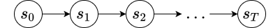
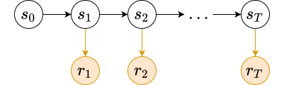
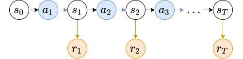

# Mathematical foundations of reinforcement learning

All of reinforcement learning is based on the **reward hypothesis**:

> Every action of a rational agent can be thought of as seeking to maximize some cumulative scalar reward signal.

We usually think of reinforcement learning scenarios as consisting of an **agent** and an **environment**, which we formalize using the notion of a **Markov decision process** (MDP). We will build up an understanding of MDPs in the following section.

## Markov Process $(\mathcal{S}, \mathcal{P})$

A **Markov process** is a kind of mathematical object used to model stochastic sequences of states $s_0, s_1, \dots, s_T$ that satisfy the **Markov property**:
$$
p(s_{t+1} \mid s_1, s_2, \dots, s_t) = p(s_{t+1} \mid s_t)
$$

which, translated, states that

> The probability of transitioning to a state $s_{t+1}$ given a current state $s_t$ is independent of previous states $s_1 \dots s_{t-1}$.

where subscript $t$ means "at some time step $t$".

Formally, a Markov process is a tuple $(\mathcal{S}, \mathcal{P})$ where $\mathcal{S}$ is a set of states and $\mathcal{P}(s_t, s_{t+1})$ is probability of transitioning from a state $s_t$ to a state $s_{t+1}$.

Given some initial state $s_0$, we can generate a **trajectory** $\tau$ of states of $\{ s_0, s_1, \dots, s_T \}$. 

To help understand a Markov process, consider how to calculate the probability of an arbitrary trajectory. We can calculate the probability of a trajectory $\tau$ by

$$
\begin{align}
p(\tau) &= p(s_0) p(s_1 \mid s_0) p(s_2 \mid s_1) \dots p(s_T \mid s_{T-1}) \\
&= p(s_0) \prod_{t=0}^{T-1} p(s_{t+1} \mid s_t) \\
&= p(s_0) \prod_{t=0}^{T-1} \mathcal{P} (s_t, s_{t+1})
\end{align}
$$



When $\mathcal{S}$ is discrete, we can represent $\mathcal{P}$ using a table. Each $\mathcal{P}_{i, j} = p(s_j \mid s_i)$ is just the probability of transitioning from state $s_i$ to state $s_j$.

We also additionally specify a probability distribution over initial state $p(s_0)$.


```python
import numpy as np; np.random.seed(0)
```

Let's solidify our understanding by creating a `MarkovProcess` class for a Markov process with a discrete state space.

The class should know the number of discrete states.


```python
class MarkovProcess:
    def __init__(self, N):
        '''
        N (int): number of states.
        '''
        self.N = N
        self.S = range(N)  # state space
        P = [np.random.rand(N) for _ in range(N)]  # probability transition table
        self.P = np.vstack([p/p.sum() for p in P])  # normalize
        p_s_0 = np.random.rand(N)  # distribution over initial states s_0
        self.p_s_0 = p_s_0/p_s_0.sum()  # normalize
    
    def generate_trajectory(self, T):
        s_0 = np.random.choice(self.S, p=self.p_s_0)
        tau = [s_0]  # trajectory
        s_t = s_0
        for t in range(T):
            # discrete probability distribution over next states  
            s_t = np.random.choice(self.S, p=self.P[s_t])
            tau.append(s_t)
        return tau
```

Let's randomly generate a Markov process with 5 states.


```python
mp = MarkovProcess(5)
mp.P
```


    array([[0.19356424, 0.25224431, 0.21259213, 0.19217803, 0.14942128],
           [0.19440831, 0.13170981, 0.26841564, 0.29005381, 0.11541244],
           [0.27439982, 0.18330691, 0.19687558, 0.32079767, 0.02462001],
           [0.03366488, 0.00781195, 0.32170632, 0.30066296, 0.3361539 ],
           [0.31185458, 0.25466645, 0.14705881, 0.24872985, 0.0376903 ]])


The columns `S[i]` of the transition matrix give the probabilities of transition to another state `j`:


```python
mp.P[3]
```


    array([0.03366488, 0.00781195, 0.32170632, 0.30066296, 0.3361539 ])


We can then use this transition matrix to sample trajectories given a number of timesteps $T$.


```python
mp.generate_trajectory(10)
```


    [1, 3, 3, 3, 0, 2, 2, 2, 3, 4, 1]


Now that we understand what a Markov process is, we can add the next bit: rewards.

## Markov Reward Process $(\mathcal{S}, \mathcal{P}, \mathcal{R})$

A Markov reward process is a Markov process that additionally defines a **reward function** $\mathcal{R}$ over state transitions. Given a state transition $(s_t, s_{t+1})$ from our Markov process, we get a scalar reward $r_t$ indicating how "good" that transition was. For example, let's say $s_t$ is standing at the edge of a cliff. If $s_{t+1}$ is off the cliff, then we would get a low reward. If $s_{t+1}$ is back from the edge of the cliff, we get a high reward.

Technically, the reward function defines a probability distribution over rewards for any given state transition. When we run the Markov reward process (i.e., when we generate trajectories) we sample from that distribution to get our **instantaneous reward** $r_t$. The definition for the reward function is thus
$$
\mathcal{R}(s_t, s_{t+1}) = \mathbb{E}[r_t \mid s_t, s_{t+1}]
$$
the mean of the distribution. 

Sometimes the reward is produced deterministically, so that
$$
\mathcal{R}(s_t, s_{t+1}) = r_t
$$

Also, to simplify analysis, we sometimes simply associate the reward $r_t$ with the state $s_{t+1}$. In this way, the initial state $s_0$ is not associated with a reward, but each subsequent state $s_1, s_2, \dots, s_T$ is. The idea is that usually, the goodness moving from state $s_t$ to state $s_{t+1}$ is determined by how good $s_{t+1}$ is. This is often how Markov reward processes are implemented.



Given a trajectory of state $\{ s_0, s_1, \dots, s_T \}$ we can associate a trajectory of rewards $\{ r_1, r_2, \dots, r_T \}$. The **return** of a trajectory starting at time step $t$ is the sum of the instantaneous rewards from $t$ to $T$ (the end of the trajectory).
$$
R_t = r_t + r_{t+1} + \dots + r_T = \sum_{k=t}^T r_k
$$

Good trajectories are ones with high returns. 

So far it has been implicit that $T$ (the length of the trajectory) is finite. However, this does not have to be the case. In general, trajectories can continue forever (i.e., $T = \infty$). When a Markov process has finite $T$ we say that it is "episodic" (trajectories happen in "episodes"), and if has infinite $T$ we say that it is "continuous". For this reason, we generally refer to $T$ as the **time horizon** for the process.

This poses a problem. If the process is continuous, then there can be many trajectories with the same infinite return $R_t$. If one trajectories sees rewards of $\{ 1, 1, 1, \dots \}$ and one sees rewards of $\{ 100, 100, 100, \dots \}$, they will get the same return $R_t$. However, clearly the second one is better. To get around this, we often use the **discounted return** $G_t$:
$$
G_t = r_t + \gamma r_{t+1} + \gamma^2 r_{t+2} + \dots = \sum_{k=t}^T \gamma^{k-t} r_k
$$

which discounts each instantenous reward $r_k$ by some **discount factor** $\gamma \in (0, 1]$. 

The discount factor $\gamma$ controls how much rewards in the future influence $G_t$. For large values of $\gamma$, the sequence $\gamma, \gamma^2, \gamma^3, \dots$ decays slowly, so rewards far into the future are weighted more. Likewise, for small values of $\gamma$, that sequence decays quickly, so rewards far into the future are weighted less. In practice, we often take  $\gamma = 0.99$ or $\gamma = 0.999$.

In practice, we usually implement Markov reward processes by making the reward dependent only on the subsequent state in a state transition, i.e. $\mathcal{R}(s_t, s_{t+1}) = \mathcal{R}(s_{t+1})$. This means that the reward only depends on where you end up and not how you got there.

Let's implement $\mathcal{R}$ for a discrete state space using the approach above. We subclass the `MarkovProcess` class to automatcally include all of the instance variables from a Markov process (like `N`, `S`, `P`, etc). We have to override the `generate_trajectory` method to differentiate between the trajectory of states $\tau_s$ and trajectory of rewards $\tau_r$.


```python
class MarkovRewardProcess(MarkovProcess):
    def __init__(self, N):
        '''
        N (int): number of states.
        '''
        super(MarkovRewardProcess, self).__init__(N)
        self.R = np.random.randn(N)
    
    def generate_trajectory(self, T):
        '''
        T (int): number of timesteps.
        '''
        s_0 = np.random.choice(self.S, p=self.p_s_0)
        tau_s = [s_0]
        tau_r = []
        s_t = s_0
        for t in range(T):  
            s_t = np.random.choice(self.S, p=self.P[s_t])
            r_t = self.R[s_t]
            tau_s.append(s_t)
            tau_r.append(r_t)
        return tau_s, tau_r
```


```python
mrp = MarkovRewardProcess(5)
tau_s, tau_r = mrp.generate_trajectory(10)
```


```python
tau_s
```


    [0, 1, 3, 0, 3, 2, 1, 3, 0, 3, 4]


```python
tau_r
```


    [-0.027971183469780222,
     0.6467800971387857,
     0.42539339846964996,
     0.6467800971387857,
     1.4759898324822718,
     -0.027971183469780222,
     0.6467800971387857,
     0.42539339846964996,
     0.6467800971387857,
     -0.3643343119343121]


### Value Function

We can determine how good being in a certain state $s_t$ is using the **value function** $V(s_t)$:
$$
V(s_t) = \mathbb{E}_\tau [G_t \mid s_t]
$$
the expected discounted return beginning at state $s_t$. We write the expectation over $\tau$ as a shorthand for $\tau \sim p(\tau \mid s_t, \mathcal{S})$, which means "trajectories $\tau$ sampled from the distribution of trajectories conditional on the initial state $s_t$ and the state transition matrix $\mathcal{S}$". We showed above how to calulate the probability of a trajectory $p(\tau)$, so the notion of a "distribution of trajectories" should be clear.

We can expand $G_t$ in the expectation to yield a recursive formulation of $V(s_t)$:

$$
\begin{align}
V(s_t) &=  \mathbb{E}_\tau [G_t \mid s_t] \\
&=  \mathbb{E}_\tau [r_t + \gamma r_{t+1} + \gamma^2 r_{t+2} + \dots \mid s_t] \\
&=  \mathbb{E}_\tau [r_t + \gamma (r_{t+1} + \gamma r_{t+2} + \dots) \mid s_t] \\
&=  \mathbb{E}_\tau [r_t + \gamma G_{t+1} \mid s_t] \\
&=  \mathbb{E}_\tau [r_t + \gamma V(s_{t+1}) \mid s_t] \\
\end{align}
$$

This last formulation is known as the **Bellman equation**. We can use it to get an estimate for $V(s_t)$.

Imagine we are in a state $s_t$, and then transition to a state $s_{t+1}$, receiving a reward $r_t$. Imagine we have an estimate for $V(s)$ for each $s \in \mathcal{S}$. After this state transition, we have a slightly better estimate for $V(s_t)$, namely $r_t + \gamma V(s_{t+1})$. Then we can use a simple update rule like

$$
V(s_t) \gets (1 - \alpha) V(s_t) + \alpha \left( r_t + \gamma V(s_{t+1}) \right)
$$

to move our estimate for $V(s_t)$ towards the slightly better estimate, where $\alpha \in (0, 1]$ is a **learning rate** (often close to $0$).

Note that this is equivalent to doing gradient descent on the squared error between $V(s_t)$ and $r_t + \gamma V(s_{t+1})$, holding the latter constant:
$$
\begin{align}
L(V(s_t)) &= \frac{1}{2} \left( r_t + \gamma V(s_{t+1}) - V(s_t) \right)^2 \\
\frac{dL}{dV(s_t)} &= - \left( r_t + \gamma V(s_{t+1}) - V(s_t) \right)
\end{align}
$$

by the gradient descent update rule:

$$
\begin{align}
V(s_t) &\gets V(s_t) - \alpha \frac{dL}{dV(s_t)} \\
&= V(s_t) + \alpha \left( r_t + \gamma V(s_{t+1}) - V(s_t) \right) \\
&= V(s_t) + \alpha \left( r_t + \gamma V(s_{t+1}) \right) -  \alpha  V(s_t) \\
&= (1 - \alpha) V(s_t) + \alpha \left( r_t + \gamma V(s_{t+1}) \right)
\end{align}
$$

*This will become more relevant later when the state space $\mathcal{S}$ is no longer discrete.*

Here's an implementation of estimatating $V$ using this update rule:


```python
def estimate_V(mrp, T, gamma, alpha, epochs):
    '''
    mrp (MarkovRewardProcess): mrp to use
    T (int): number of time steps
    gamma (float): discount factor
    alpha (float): learning rate
    epochs (int): number of iterations to learn
    '''
    V = np.random.rand(mrp.N)*1e-2
    for e in range(epochs):
        s_t = np.random.choice(mrp.S, p=mrp.p_s_0)
        for t in range(T):  
            s_t_next = np.random.choice(mrp.S, p=mrp.P[s_t])
            r_t = mrp.R[s_t_next]
            V[s_t] = (1-alpha)*V[s_t] + alpha*(r_t + gamma*V[s_t_next])
            s = s_t_next
    return V
```


```python
estimate_V(mrp, T=10, gamma=0.99, alpha=0.001, epochs=10000)
```


    array([2.1074364 , 1.9126743 , 2.10367341, 2.02000435, 2.06266409])


It makes sense that these values are similar, since the state transition matrices were originally selected randomly uniformly, so no one state tends to produce consistently bad or consistently good trajectories. 

Let's force that by making the reward for being in state $0$ relatively high.


```python
mrp.R[0] = 10
```

Let's define a custom `P` with high probability of returning to state `0` from state `0`, and low probability of transitioning to state `0` from other states:


```python
P = [np.random.rand(mrp.N) for _ in range(mrp.N)]
P[0][0] = 1000
for i in range(1, mrp.N):
    P[i][0] = 0.001
mrp.P = np.vstack([p/p.sum() for p in P])
```


```python
estimate_V(mrp, T=10, gamma=0.99, alpha=0.001, epochs=10000)
```


    array([238.70471114,   3.57678785,   4.09577522,   2.4376589 ,
             4.0398525 ])


Since trajectories beginning with state $0$ are likely to return to state $0$, and since state $0$ has large reward, we can expect $V(0)$ to be large.

## Markov Decision Process $(\mathcal{S}, \mathcal{P}, \mathcal{R}, \mathcal{A})$

In a Markov process (and by consequence, a Markov reward process), the sequence of states visited during a trajectory is determined entirely by $\mathcal{P}$. Imagine an **agent** that lives in the state space $\mathcal{S}$, who moves from state to state. They have no control over where they visit and are entirely at the mercy of the underlying dynamics of the process.

In a Markov decision process (MDP), the agent in a state $s_t$ can influence the probability distribution over next states $s_{t+1}$ by selecting an **action** $a_t$ from an **action space** $\mathcal{A}$:

$$
\mathcal{P}(s_t, a_t, s_{t+1}) = p(s_{t+1} \mid s_t, a_t)
$$

We can introduce a notion equivalent to the value function $V(s_t)$, but that measures how good state-action pairs $(s_t, a_t)$ are.
$$
Q(s_t, a_t) = \mathbb{E}_\tau [G_t \mid s_t, a_t]
$$
the expected discounted return beginning at state $s_t$ and choosing an action $a_t$. We write the expectation over $\tau$ as a shorthand for $\tau \sim p(\tau \mid s_t, a_t, \mathcal{S})$, which means "trajectories $\tau$ sampled from the distribution of trajectories conditional on the initial state $s_t$ and inital action $a_t$, and the state transition matrix $\mathcal{S}$".

We can expand $G_t$ in the expectation to yield a recursive formulation of $Q(s_t, a_t)$ following the exact same method as for $V(s_t)$, yielding
$$
Q(s_t, a_t) = \mathbb{E}_\tau [r_t + \gamma Q(s_{t+1}, a_{t+1}) \mid s_t, a_t] \\
$$

Subtle note: the trajectories $\tau$ are now generated according to an action $a_t$ at each time step. How can we take the expectation over all trajectories if we don't know how to choose an action at each time step? This is addressed in the next section.



## Policies

An agent living in an MDP needs to have a method for selecting actions $a_t$ given the state $s_t$. Recall the reward hypothesis:

> Every action of a rational agent can be thought of as seeking to maximize some cumulative scalar reward signal.

If we frame this in terms of MDPs, this means that the policy should select actions $a_t$ that maximize the discounted return $G_t$.

Policies come in two flavours: deterministic and stochastic. Deterministic policies are often denoted by $\mu$ and map states directly to actions: $a_t = \mu(s_t)$. Stochastic policies are denoted by $\pi$ and map states to a probability distribution over actions $a_t \sim \pi(\cdot \mid s_t)$. In general, since deterministic policies are just a special case of stochastic policies, we use $\pi$ when referring to policies.

Given a policy $\pi$ we define
$$
V^\pi (s_t) = \mathbb{E}_\tau \left[ G_t \vert s_t \right]
$$
Where the expectation over $\tau$ is a shorthand for $\tau \sim p(\tau \mid s_t, a_t, \pi, \mathcal{S})$, which means "trajectories $\tau$ sampled from the distribution of trajectories conditional on the initial state $s_t$, following state dynamics $\mathcal{S}$ and action selection policy $\pi$".

We also likewise define

$$Q^\pi (s_t, a_t) = \mathbb{E}_\tau \left[ G_t \vert s_t, a_t \right]$$

Where the expectation over $\tau$ is a shorthand for $\tau \sim p(\tau \mid s_t, a_t, \pi, \mathcal{S})$, which means "trajectories $\tau$ sampled from the distribution of trajectories conditional on the initial state $s_t$ and inital action $a_t$, following state dynamics $\mathcal{S}$ and action selection policy $\pi$".

The crucial difference between $V^\pi(s_t)$ and $Q^\pi(s_t, a_t)$ is that $V^\pi(s_t)$ is the expected discounted return if we *always* choose actions following the policy $\pi$, whereas $Q^\pi(s_t, a_t)$ is the expected discounted return if we choose a *specific* action $a_t$, and *then* follow our policy $\pi$ afterwards.

With this understanding, the following relationship should be clear:
$$
V^\pi(s_t) = \mathbb{E}_{a_t \sim \pi} \left[ Q^\pi(s_t, a_t) \right]
$$

Below, we implement an MDP and estimate the the Q function for state-action pairs. The `generate_trajectory` method accepts a new parameter `pi` representing the policy. 


```python
class MarkovDecisionProcess(MarkovRewardProcess):
    def __init__(self, N, M):
        super(MarkovDecisionProcess, self).__init__(N)
        '''
        N (int): number of states
        M (int): number of actions
        '''
        self.M = M
        # P is now a tensor of shape NxMxN
        # P[s, a] is a multinomial distribution
        # over next states
        P = []
        for n in range(N):
            p = [np.random.rand(N) for _ in range(M)]
            P.append(np.vstack([q/q.sum() for q in p]))
        self.P = np.asarray(P)
    
    def generate_trajectory(self, pi, T):
        '''
        pi (callable): maps states to actions
        T (int): number of timesteps
        '''
        s_0 = np.random.choice(self.S, p=self.p_s_0)
        tau_s = [s_0]
        tau_r = []
        tau_a = []
        s_t = s_0
        for t in range(T):
            a_t = pi(s_t) # generate action
            s_t = np.random.choice(self.S, p=self.P[s_t, a_t])
            r_t = self.R[s_t]
            tau_s.append(s_t)
            tau_r.append(r_t)
            tau_a.append(a_t)
        return tau_s, tau_r, tau_a
```


```python
mdp = MarkovDecisionProcess(5, 2)
```

For simplicity we use a random uniform policy to demonstrate generating trajectories using an MDP.


```python
pi = lambda s_t: np.random.choice(mdp.M)
```


```python
tau_s, tau_r, tau_pi = mdp.generate_trajectory(pi, 10)
```


```python
tau_s
```


    [1, 1, 3, 2, 4, 2, 2, 3, 0, 3, 0]


```python
tau_r
```


    [0.44112903184475766,
     -0.508447116792912,
     -0.24373616170458026,
     -1.0738334450260647,
     -0.24373616170458026,
     -0.24373616170458026,
     -0.508447116792912,
     -0.6787773894547808,
     -0.508447116792912,
     -0.6787773894547808]


```python
tau_pi
```


    [0, 0, 0, 0, 0, 1, 0, 1, 1, 1]


## $Q$-Learning

A random policy isn't interesting. Let's consider the notion of an **optimal policy**. What does it mean to have an optimal policy? The optimal policy $\pi^*$ produces trajectories with the highest expected discounted return. Imagine that, for any policy $\pi$ we can automatically determine $V^\pi$ and $Q^\pi$. 

An optimal policy $\pi^*$ would then always choose an action $a_t$ at each step which maximizes $Q^{\pi^*}$.
$$
\pi^*(s_t) = \arg \max_{a_t} Q^{\pi^*}(s_t, a_t)
$$

We call this a **greedy policy** (because it always chooses the best option immediately available). For this policy to make any sense, we need to have access to $Q^{\pi^*}$. However, it is difficult to determine $Q^\pi$ for any policy $\pi$ since in general an agent will not have access to the underlying state dynamics $\mathcal{P}$. 

In general, the $Q^\pi$ (and $V^\pi$) functions must be **learned**. For MDPs with small, discrete state spaces and small, discrete action spaces, we can try to use dynamic programming to solve this. This is the exact same approach that we used to learn $V$ for a Markov reward process, except instead of having a parameter for each state $s \in \mathcal{S}$, we now have a parameter for each state-action pair $(s, a) \in \mathcal{S} \times \mathcal{A}$.

Authors often omit the $\pi$ from $Q^\pi$ and $V^\pi$ when referring to the learned version of these functions, though some others prefer $\widehat{Q}^\pi$ and $\widehat{V}^\pi$. For simplicity of notation, we choose to omit the $\pi$ here.

Consider the following series of events:

1. You are in a state $s_t$
2. You choose an action $a_t$ which maximizes $Q(s_t, a_t)$ (since we are following a greedy policy)
3. You get a reward $r_t$
4. You transition to the next state $s_{t+1}$

At this point, you have a slightly better estimate for $Q^\pi(s_t, a_t)$ according to the Bellman equation, namely 

$$
r_t + \gamma \max_{a_{t+1}} Q(s_{t+1}, a_{t+1})
$$ 

(where we take the max over $a_t$ since we assume that's what our greedy policy will choose)

We then update the table to be closer to the better estimate with some learning rate $\alpha$ 

$$
Q(s_t, a_t) \gets (1 - \alpha)Q(s_t, a_t) + \alpha \left( r_t + \gamma \max_{a_{t+1}} Q(s_{t+1}, a_{t+1}) \right)
$$

This is exactly like our previous scenario where we used dynamic programming to learn $V$. 


```python
def estimate_Q(mdp, pi, T, gamma, alpha, epochs):
    Q = np.random.rand(mdp.N, mdp.M)*1e-2
    for e in range(epochs):
        s_t = np.random.choice(mdp.S, p=mdp.p_s_0)
        for t in range(T):
            a_t = np.argmax(Q[s_t])
            s_t_next = np.random.choice(mdp.S, p=mdp.P[s_t, a_t])
            r_t = mdp.R[s_t_next]
            a_t_next = np.argmax(Q[s_t_next])
            Q[s_t, a_t] = (1-alpha)*Q[s_t, a_t] + alpha*(r_t + gamma*Q[s_t_next, a_t_next])
            s = s_t_next
    return Q
```


```python
Q = estimate_Q(mdp, pi, 10, gamma=0.99, alpha=0.001, epochs=10000)
Q
```


    array([[-1.96995822, -1.96971622],
           [-1.84711799, -1.84809373],
           [-1.06378587, -1.06275465],
           [-1.76588746, -1.75955787],
           [-1.81627675, -1.81858411]])


Once we have an estimate for $Q$, we can use it in a greedy policy that just always chooses the action $a_t$ for a given state $s_t$ that maximizes the estimated $Q(s_t, a_t)$.


```python
greedy_pi = lambda s_t: np.argmax(Q[s_t])
```

Let's compare this policy's return $R_t$ with that of the random policy:


```python
tau_s, tau_r, tau_pi = mdp.generate_trajectory(pi, 10000)
sum(tau_r)
```


    -4366.367719843221


```python
tau_s, tau_r, tau_pi = mdp.generate_trajectory(greedy_pi, 10000)
sum(tau_r)
```


    -2704.3221227920258


We can see that the greedy policy does much better than the random policy.

In the next post, we will introduce the OpenAI `gym` module for reinforcement learning and discuss Q-learning and deep-Q-learning in more detail.

You can download the jupyter notebook [here]().
